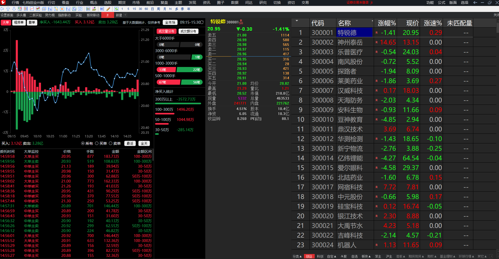
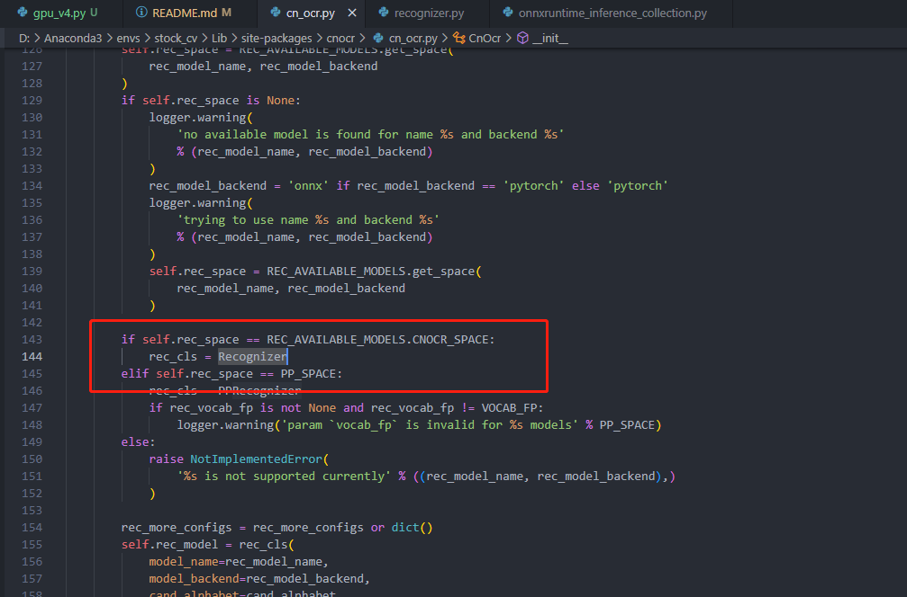
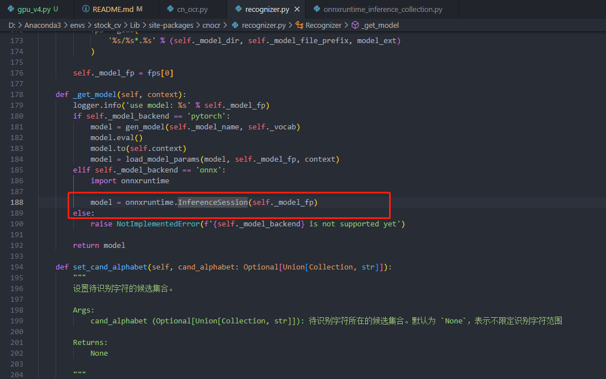
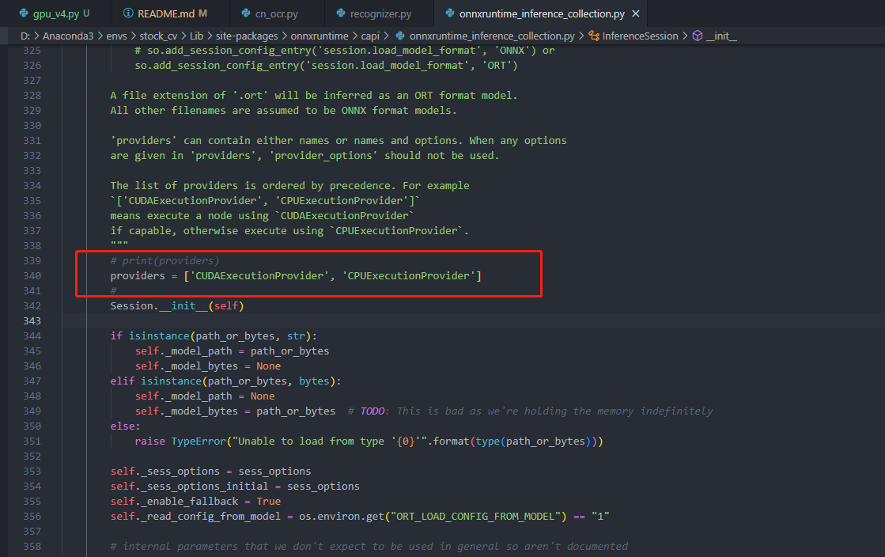
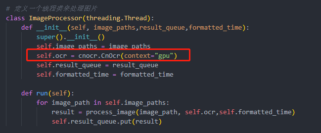

针对股票截图，提取文本到csv、xlsx中  
原数据在data中，类似 
  

输出格式类似    

[输出excel](https://github.com/liugehaizaixue/stock_cv/blob/main/res/%E6%96%87%E6%9C%AC2023-04-19.xlsx)


v1 v2 v3 均为单线程  

moremodel 为多线程工作，同时每个线程独享一个cnocr模型   

singlemodel 多线程，每个线程公用一个cnocr   

### 2023-04-22 环境版本修改
torch与cuda版本
```
pip install torch==1.12.1+cu116 torchvision==0.13.1+cu116 torchaudio==0.12.1 --extra-index-url https://download.pytorch.org/whl/cu116
```

同时修改了cnocr版本
原先使用的是cnocr==2.2.2
现在是cnocr==2.2.2.3

### 使用gpu  

但不是很懂具体如何使用，cnocr的手册说明的不是很清楚 ,如下
#### GPU 环境使用 ONNX 模型  
默认情况下安装的 ONNX 包是 onnxruntime，它只能在 CPU 上运行。如果需要在 GPU 环境使用 ONNX 模型，需要卸载此包，然后安装包 onnxruntime-gpu 。  
```
pip uninstall onnxruntime
pip install onnxruntime-gpu
```
  

👆在自己探索过程报错，查询后需要将onnxruntime与onnxruntime-gpu 都删掉 重新安装
```
AttributeError: module ‘onnxruntime‘ has no attribute ‘InferenceSession‘
```

#### 自己探索之后，我CnOcr类中的 Recognizer类 下 自己传入了   
在cnocr==2.2.2.3下  

  
  
  

  
```python  
providers = ['CUDAExecutionProvider', 'CPUExecutionProvider']  
```  
 
在gpu_v4版本中，  
    
